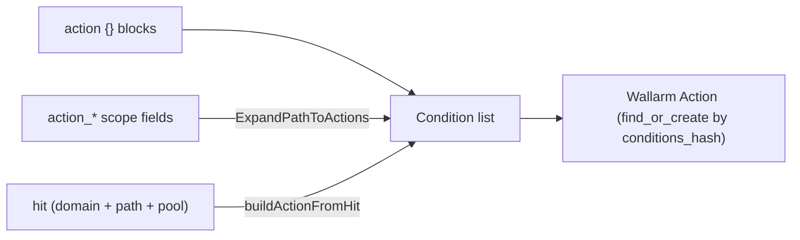

# Action conditions and path expansion

Reference for how a Wallarm rule's **Action** (its match scope) is defined and
built in the provider: the condition structure, the two provider-side ways to
author conditions, and the path-to-action derivation used by the hits flow. The
shared Action/Condition/Hint model and CRUD machinery are in `rules-core.md`;
this doc is the condition-authoring and path-expansion detail.

## 1. Overview

An Action is an ordered list of **Conditions**; each Condition matches one part
of a request (a header, a path segment, the method, ...). The provider produces
that condition list three ways, all yielding the same Wallarm Action:

| Source | Where | Used by |
|---|---|---|
| Explicit `action {}` blocks | user HCL, validated in `ActionScopeCustomizeDiff` | any `wallarm_rule_*` resource |
| Human-friendly `action_*` scope fields | expanded provider-side (`ExpandPathToActions`) | any `wallarm_rule_*` resource |
| Derived from a hit (path-to-action) | `buildActionFromHit` (`data_source_hits.go`) | `data.wallarm_hits` -> FP-suppression rules (`hits-to-rules.md`) |

When any `action_*` scope field is set it takes priority and the provider
computes the `action` set from it; with no scope field, explicit `action {}`
blocks are used as-is. The hit-derivation path is internal to the hits data
source and never mixes with either. Heavy expansion logic lives in the provider
(Go), not in HCL; the `examples/` modules are thin consumers.

## 2. Model



A Condition has three fields:

| Field | Meaning |
|---|---|
| `point` | single-key map naming the request part, e.g. `{header="HOST"}`, `{path="0"}`, `{action_name=...}` |
| `type` | match type: `equal` / `iequal` / `regex` / `absent` (or `""` for point-value points) |
| `value` | the matched content - or `""` when the content lives in the point map (see below) |

**Point-value vs paired-value points.** For some points the matched content sits
in the point map and `value` must be empty; for others the content is in `value`:

- **Point-value** (`PointValuePoints`, `value=""`): `action_name`, `action_ext`,
  `method`, `proto`, `scheme`, `uri`, `instance`.
- **Paired-value** (content in `value`): `header` (name in the point map, matched
  value in `value`), `query` (key in the point map, value in `value`), and
  `path` (index in the point map, segment string in `value`).

## 3. Elements

### 3.1 Schema surfaces

| Element (`action_scope.go`) | Responsibility |
|---|---|
| `ScopeActionSchema()` | `action {}` set schema - Optional+Computed, `ForceNew`, hashed by `HashActionDetails` (a scope change is a different hint) |
| `ScopeActionSchemaMutable()` | same element shape without `ForceNew`/`Computed`, for APIs that update conditions in place (e.g. `wallarm_api_spec_policy` PUT) |
| `ActionScopeFields` | the human-friendly scope fields (`action_path`, `action_domain`, `action_instance`, `action_method`, `action_scheme`, `action_proto`, `action_query`, `action_header`) added to every rule resource via `lo.Assign` |

### 3.2 Expansion and validation code

| Function | File | Role |
|---|---|---|
| `ActionScopeCustomizeDiff` | `action_scope.go:206` | validates `action {}` blocks; when scope fields are set, computes the `action` set via `SetNew` |
| `ExpandPathToActions` | `action_reverse_map.go:263` | scope fields -> `[]ActionDetails` (instance, domain, headers, path, method, scheme, proto, query) |
| `expandPath` / `parseLastSegment` | `action_reverse_map.go:341` / `:439` | path string -> path/action_name/action_ext conditions, incl. `*` / `**` handling |
| `validateActionSet` | `action_scope.go:365` | point-key, single-key, URI-conflict, and type/value rules for explicit blocks |
| `buildActionFromHit` / `locationToConditions` / `actionNameExtConditions` | `data_source_hits.go:669` / `:706` / `:759` | hit-derived path-to-action |

### 3.3 Consumers

The `examples/` modules are thin consumers, not logic holders:

- `examples/hits-to-rules/` - exercises `data.wallarm_hits` and the hit-derived
  action scope (`hits-to-rules.md`).
- `examples/import-rules/` - bulk import via `data.wallarm_rules`.

## 4. Behavior

### 4.1 Choosing an authoring style

- Setting any `action_*` scope field makes the `action` set **Computed** from
  those fields, which override any explicit `action {}` blocks via `SetNew`
  (scope fields take priority); explicit blocks are used verbatim only when no
  scope field is set. There is no `ConflictsWith` guard - priority resolves the
  overlap.
- On an existing resource the action set is recomputed only when a scope field
  actually changes (`anyScopeFieldChanged`); all scope fields are `ForceNew`, so
  a scope change replaces the hint.

### 4.2 `action_path` expansion (human-friendly)

`expandPath` decomposes `action_path`:

- `""` -> no path conditions.
- `/**/*.*` (`pathGlobalWildcard`) -> no conditions (match everything).
- `/` (root) -> `action_name=""` (equal) + `action_ext` absent + `path[0]` absent.
- otherwise split on `/`; the last segment is the action component, the rest are
  directory segments:
  - `action_name`: emitted `equal` unless it is `*` (then skipped = match any).
  - `action_ext`: `equal` for a specific extension; skipped when the extension is
    `*` (`name.*`); `absent` when the segment has no dot.
  - directory segments: `path[i]=segment` (`equal`), each `*` segment skipped.
  - **limiter**: a trailing `path[N]` `absent` (N = directory-segment count) that
    fixes the path depth, so a deeper path does not match. Suppressed when a `**`
    globstar is present.
- `**` globstar: allowed only as the last directory segment; it is stripped and
  suppresses the limiter, allowing any depth after the prefix.

The last segment decomposes into `action_name` / `action_ext` by splitting on
the **first** dot (`parseLastSegment`): `archive.tar.gz` -> name `archive`, ext
`tar.gz`. See the R-002 note in §4.3 - the hits side and this side use the same
split.

### 4.3 Hit-derived path-to-action

`buildActionFromHit(domain, urlPath, poolID, includeInstance)`:

- **instance** emitted when `includeInstance` is true and `poolID != 0` (`-1`, the
  default app, and positive IDs are emitted; `0` = unspecified is skipped), to
  match the API's `ActionReadByHitID` response on instance-included clients.
- **HOST header** (`iequal`) when `domain != ""`.
- `urlPath == "[multiple]"` (`hitsPathMultiple`, the attack spans paths) -> no
  path/action_name/action_ext conditions, giving a HOST-only wildcard scope.
- otherwise `locationToConditions` decomposes the path: root -> `action_name=""` +
  `path[0]` absent; else `actionNameExtConditions(last)` + `path[i]=segment` for
  each directory segment + a terminating `path[N]` absent.

The last segment splits into `action_name` / `action_ext` on the **first** dot,
matching the API's own decomposition and the `action_path` side (§4.2):
`archive.tar.gz` -> name `archive`, ext `tar.gz`. Unlike `action_path`, the hit
path has no `*` / `**` / global-wildcard handling - it always fully decomposes
the observed path. It still emits the terminating `path[N]` absent limiter that
fixes the depth (there is just no `**` case to suppress it).

> **Known bug (R-002):** the code currently splits on the **last** dot
> (`strings.LastIndex`) at both sites - `actionNameExtConditions`
> (`data_source_hits.go:760`) and `parseLastSegment`
> (`action_reverse_map.go:441`) - so `archive.tar.gz` wrongly yields ext `gz` and
> the hit-derived scope disagrees with the API (a hard error in the hits flow).
> The fix is `strings.Index` at both sites; tracked as R-002. This section
> describes the intended first-dot behavior. See `hits-to-rules.md §4.4`.

### 4.4 Condition normalization

- `iequal` values are downcased server-side; the provider mirrors this so state
  stays stable, and `suppressIequalValueCaseDiff` /
  `suppressIequalPointValueCaseDiff` suppress case-only diffs on `iequal`
  point-value and paired-value fields.
- Header **names** are uppercased on both authoring paths (`strings.ToUpper`);
  header-name case diffs are always suppressed (RFC 7230 case-insensitive).

### 4.5 Validation (`validateActionSet`, explicit blocks)

- Each `point` map must contain exactly one key.
- The key must be one of `validPointKeys` (typo guard).
- `uri` conflicts with `path` / `action_name` / `action_ext` / `query` (a full-URI
  match cannot mix with decomposed parts).
- A `PointValuePoints` key with a non-`absent` type must have `value=""`.
- `header` and `query` with a non-`absent` type must have a non-empty `value`.

## 5. Parameters

### 5.1 `ActionScopeFields`

| Field | Type | Default | Meaning |
|---|---|---|---|
| `action_path` | string | computed | URL path pattern; `*` = any segment, `**` = any depth |
| `action_domain` | string | computed | HOST-header match; `*` = any domain (no condition) |
| `action_instance` | string | computed | application pool (instance) ID |
| `action_method` | string | computed | HTTP method |
| `action_scheme` | string | computed | URL scheme (`http`/`https`) |
| `action_proto` | string | computed | HTTP version (`1.0`/`1.1`/`2.0`) |
| `action_query` | list(key,value,type) | - | query-parameter conditions; per-entry `type` default `equal` |
| `action_header` | list(name,value,type) | - | extra header conditions; per-entry `type` default `equal` |

All are `ForceNew`. The scalar fields are `Optional+Computed`; the two list
fields are `Optional` (no `Computed`).

### 5.2 `action {}` block

| Sub-field | Meaning |
|---|---|
| `point` | single-key map; key from the point table (§6.1) |
| `type` | `equal` / `iequal` / `regex` / `absent`; send `""` (rendered `null`) for point-value points that carry no type |
| `value` | matched content for paired-value points; `""` for point-value points |

## 6. Reference data

### 6.1 Point keys

| Point key | Matches | Content location |
|---|---|---|
| `instance` | application pool ID | point map |
| `header` | request header (name uppercased) | `value` |
| `path` | path segment by 0-based index | `value` (index in point map) |
| `action_name` | last-segment name (no extension) | point map |
| `action_ext` | last-segment extension | point map |
| `uri` | full URI (exclusive with path/name/ext/query) | point map |
| `method` | HTTP method | point map |
| `scheme` | URL scheme | point map |
| `proto` | HTTP version | point map |
| `query` | query parameter by name | `value` (key in point map) |

### 6.2 Match types

| Type | Meaning |
|---|---|
| `equal` | exact, case-sensitive |
| `iequal` | case-insensitive (downcased server-side; used for HOST) |
| `regex` | regular expression (`regex.md`) |
| `absent` | the field must not exist |
| `""` | no type check (point-value points: method, scheme, proto, instance) |

### 6.3 Condition order

`ExpandPathToActions` emits: instance -> domain(HOST) -> custom headers ->
path (`action_name`, `action_ext`, `path[i]`, limiter) -> method -> scheme ->
proto -> query. `buildActionFromHit` emits: instance -> HOST -> path
(`action_name`/`action_ext` then `path[i]` then terminating absent).

### 6.4 Worked expansions (traced through `expandPath` / `locationToConditions`)

`action_path = "/api/v1/users"`, `action_domain = "example.com"`:

```
{ iequal, "example.com", {header:"HOST"} }
{ equal,  "users",       {action_name} }
{ absent, -,             {action_ext} }
{ equal,  "api",         {path:0} }
{ equal,  "v1",          {path:1} }
{ absent, -,             {path:2} }        # limiter
```

`action_path = "/api/**/users"` (globstar) drops the limiter; `action_path = "/api/*/users"`
skips the `path:1` condition but keeps the `path:2` limiter.

### 6.5 Server-side data model

The API stores the scope as Action + Condition + Hint rows. The provider talks to
HTTP endpoints, not these tables, but the shape explains provider behavior
(`find_or_create`, `ConditionsHash`, empty-Action auto-cleanup).

**`actions`**: `id` (=`action_id`), `clientid`, `name` (`[A-Za-z0-9_.-]+`, unique
per client), `conditions` (ordered list), `conditions_hash` (SHA256, UNIQUE on
`(clientid, conditions_hash)`), `conditions_count` (0-60), cached scope fields
(`endpoint_*`, `method`), booleans (`actual`/`internal`/`hidden`/`orphan`),
`endpoint_risk_score` (1-10), stats, timestamps.

- `find_or_create` reuses an Action with identical conditions; `existingHintForAction`
  relies on it. `ConditionsHash` (`hash.go`) reproduces the Ruby
  `Action.calculate_conditions_hash`.
- `nested` matches Actions whose conditions are a subset (rule inheritance:
  `/api/*` applies to `/api/users`).
- On commit the API schedules LOM compilation and rule application.

**`action_conditions`**: `type` (default `equal`), `point` (JSON Proton Point
array), `value` (absent for `absent`). `iequal` downcased server-side
(`before_validation :iequal_values_downcase`).

**`hints`**: `actionid` (FK), `type` (rule-type string), `system` (bool), `data`
(msgpack payload). `HintCreate`/`HintDelete` insert/delete here; both trigger LOM
recompilation. When an Action's last Hint is removed, an Action that has
conditions is auto-cleaned; a condition-less Action persists. The provider only
ever calls `HintDelete`, never `ActionDelete`.

## 7. References

- `rules-core.md` - shared Action/Condition/Hint model, CRUD machinery, catalog.
- `point.md` - point chaining tables; `spec/point_map.json` (raw data).
- `regex.md` - Pire engine syntax + HCL escaping for `regex` conditions.
- `hits-to-rules.md` - the hits FP-suppression flow that consumes `buildActionFromHit`.
- `spec/actions_examples.json` - real API action-condition examples.
- `examples/hits-to-rules/`, `examples/import-rules/` - thin consumer modules.
