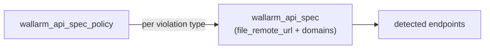

# API specs

Reference for `wallarm_api_spec` and `wallarm_api_spec_policy`: the upload/scope
model and the per-violation policy. Full field lists are the registry docs
(`docs/resources/api_spec.md`, `docs/resources/api_spec_policy.md`).

## 1. Overview

`wallarm_api_spec` registers an API specification (OpenAPI/Swagger) with Wallarm
and scopes it to domains; Wallarm detects endpoints from it. `wallarm_api_spec_policy`
attaches a per-violation policy (block / monitor / ignore) to an uploaded spec.

## 2. Model

The spec resource owns the uploaded document and its scope; the policy resource
references a spec and sets how each violation type is handled.

## 3. Elements

| Element | Role |
|---|---|
| `wallarm_api_spec` | spec upload + scope; tracks the source document |
| `wallarm_api_spec_policy` | per-violation block/monitor/ignore policy for a spec |
| wallarm-go `APISpec*` | client calls; `APISpecReadByID` for per-ID reads |

## 4. Behavior

- **URL-only ingestion.** The spec is provided via `file_remote_url`; direct
  file upload (multipart) is not yet supported (roadmap **AS1**) - host the spec
  at a URL or manage it via the console + import.
- **Drift tracking.** `file_changed_at` and the nested `file.checksum` (inside
  the computed `file` block) track the source document; `api_detection` toggles
  endpoint detection.
- **Policy.** `wallarm_api_spec_policy` sets the action per violation type
  against a referenced spec.
- **Pagination.** wallarm-go `APISpecList` is single-page (caller iterates); an
  auto-paginating `APISpecListAll` is deferred until a consumer exists (roadmap
  **AS2**).

## 5. Parameters

`wallarm_api_spec` (key fields; full list in the registry doc):

| Field | Kind | Notes |
|---|---|---|
| `file_remote_url` | input | URL of the spec document |
| `domains` | input | domains the spec scopes to |
| `description` | input | free-text label |
| `auth_headers` | input | headers used to fetch/authenticate |
| `api_detection` | input | endpoint-detection toggle |
| `api_spec_id` | computed | spec ID |
| `file_changed_at` / `created_at` | computed | source-tracking timestamps |
| `file` block (incl. `file.checksum`) | computed | uploaded-document metadata |
| `endpoints_count` | computed | detected endpoints |

`wallarm_api_spec_policy` references a spec and sets per-violation actions
(`block` / `monitor` / `ignore`); see the registry doc for the violation list.

## 6. Reference data

- `file_remote_url` is the only ingestion mode today (AS1 tracks file upload).
- `APISpecList(clientID, page, perPage)` is single-page (AS2 tracks
  `APISpecListAll`).

## 7. References

- Roadmap `AS1` (file-upload mode), `AS2` (auto-paginating list).
- `docs/resources/api_spec.md`, `docs/resources/api_spec_policy.md`.
