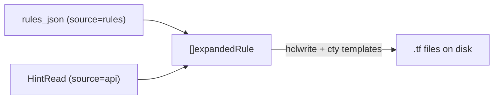

# HCL generator (`wallarm_rule_generator`)

Reference for the `wallarm_rule_generator` resource: a local HCL emitter that
writes `.tf` rule config files from pre-built rule data or existing API rules.
It is not an API rule (no Action/Hint is created); the shared rule model is in
`rules-core.md`, and the hits flow that feeds it is in `hits-to-rules.md`.

## 1. Overview

`wallarm_rule_generator` turns rule data into ready-to-apply HCL on disk. It is
the write-side of the hits-to-rules workflow: `data.wallarm_hits` produces
false-positive rule data, and this resource renders it into
`wallarm_rule_disable_stamp` / `wallarm_rule_disable_attack_type` blocks a user
then commits. Its lifecycle is **state-only** - Create writes the files, and
Delete removes the resource from state while the generated files persist on disk.

## 2. Model

Both source modes converge on a `[]expandedRule` (each carrying its own
`Actions` list of action conditions), which the `hclwrite` + `cty` templates
render into HCL. Because each rule keeps its own action block, rules from
different action scopes render with their respective conditions.

## 3. Elements

| Element | File | Responsibility |
|---|---|---|
| `resourceWallarmRuleGenerator` | `hcl_generator.go:33` | schema + state-only CRUD |
| `generateFromRulesJSON` | `hcl_generator.go:277` | `source="rules"`: parse `rules_json` -> `[]expandedRule` |
| API-source path (`HintRead`) | `hcl_generator.go:359` | `source="api"`: fetch rules, filter by `rule_types` |
| `expandedRule` / `ActionCondition` | `hcl_generator.go:531` / `hcl_generator_templates.go:14` | one expanded rule + its per-rule action conditions |
| template functions | `hcl_generator_templates.go` | `hclwrite`+`cty` rendering with correct escaping |

## 4. Behavior

- **`source = "rules"`** (default): reads `rules_json` (same structure as the
  `data.wallarm_hits` rules output); `rules_json` is required in this mode. Each
  entry needs `key`, `resource_type`, `stamp`/`attack_type`, `point`, and
  `action`.
- **`source = "api"`**: fetches rules via `HintRead` (by client, non-system),
  then filters client-side to the requested `rule_types` (defaults to all
  supported types).
- **`split`**: `true` writes one file per rule; `false` (default) writes all
  rules into one file (`output_filename`, default `{resource_prefix}_rules.tf`).
- **`moved_from`**: emits Terraform `moved {}` blocks from the named source
  resource, to migrate `for_each` keys to stable resource names without
  destroy/recreate.
- **Delete is state-only**: the resource leaves state but the generated `.tf`
  files remain on disk.

## 5. Parameters

| Field | Type | Default | Meaning |
|---|---|---|---|
| `output_dir` | string | - | required, `ForceNew`; directory for the `.tf` files |
| `source` | string | `rules` | `rules` or `api` |
| `rules_json` | string | - | sensitive; required when `source="rules"` |
| `rule_types` | list(string) | all supported | rule types to generate (validated) |
| `output_filename` | string | `{prefix}_rules.tf` | file name when `split=false` |
| `split` | bool | `false` | one file per rule when true |
| `resource_prefix` | string | `fp` (rules) / `rule` (api) | prefix for resource/local names; default depends on `source` |
| `comment` | string | `Managed by Terraform` | comment on generated resources |
| `moved_from` | string | - | source resource name for `moved {}` blocks |
| `client_id` | int | provider default | client ID in generated blocks |

Computed outputs: `generated_files` (list of written paths), `rules_count`
(number of generated rules).

## 6. Reference data

- Source-mode enum: `rules` (default) / `api` (`ValidateFunc`,
  `hcl_generator.go:70`).
- Default `resource_prefix` = `fp` for `source=rules`, `rule` for `source=api`;
  default `comment` = `Managed by Terraform`; default filename =
  `{resource_prefix}_rules.tf` (so `fp_rules.tf` or `rule_rules.tf`).
- Rendering stack: `github.com/hashicorp/hcl/v2/hclwrite` +
  `github.com/zclconf/go-cty/cty`.

## 7. References

- `rules-core.md` - the rule model the generated HCL targets (`wallarm_rule_generator`
  is listed there as an emitter, not an API rule).
- `hits-to-rules.md` - the `data.wallarm_hits` -> generator flow.
- `action.md` - action-condition structure rendered into each block.
- `examples/hits-to-rules/`, `examples/import-rules/` - consumer modules.
