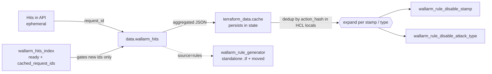

# Hits-to-Rules (false-positive mitigation)

Reference for the provider feature that turns Wallarm **hit** data into
false-positive **suppression rules** managed as Terraform state. Describes how
the code behaves; for the operator procedure see the registry guide
`docs/guides/hits_to_rules.md`.

## 1. Overview

Wallarm detects threats and records them as **hits**. Some hits are false
positives - legitimate traffic flagged as an attack. The fix is a suppression
rule that tells Wallarm to stop flagging that signature or attack type at that
request point and scope.

Hits are **ephemeral** (they age out of the API), so the suppression config
cannot be derived from live hits on every plan - it must be captured into
Terraform state once and then persist independently. This feature does that: a
data source reads hits and transforms them into a scope (`action`) plus grouped
signatures; a gating resource ensures each request is fetched only once; and two
rule resources create the actual suppressions. The pieces are wired together in
the reference module `examples/hits-to-rules/`.

Scope of this doc: `data.wallarm_hits`, `wallarm_hits_index`,
`wallarm_rule_disable_stamp`, `wallarm_rule_disable_attack_type`, and how they
compose. The HCL generator's role in the flow is summarized here; its full
behavior is in `hcl-generator.md`.

## 2. Model

A hit carries a detection **point** (where in the request the signature
matched), one or more **stamps** (numeric signature IDs), an **attack type**
(`sqli`, `xss`, ...), and request metadata (`domain`, `path`, `poolid`,
`attack_id`, `request_id`). Hits of the same HTTP request share `request_id`;
hits of the same campaign share `attack_id`.

Suppression is expressed against an **action** (the match scope: host + URL path
+ optionally the application instance) and a **point**. Two rule shapes exist:

- **disable_stamp** - allow one specific signature (`stamp`) at a point.
- **disable_attack_type** - allow a whole attack type at a point (the only
  option for stampless types, see § 6).



The action scope produced by the data source uses the **exact same schema** as
every `wallarm_rule_*` resource (`resourcerule.ScopeActionSchema()`), so
`data.wallarm_hits.<x>.action` can be passed straight into a rule's `action`
argument.

## 3. Elements

| Element | Kind | Responsibility |
|---|---|---|
| `data.wallarm_hits` | data source | Fetch hits for one `request_id`, validate their action is consistent, optionally expand by attack campaign, compute the action scope + hash, group signatures per point, emit the compact `aggregated` payload. |
| `wallarm_hits_index` | resource | Persistent per-client index of already-fetched request IDs. Exposes `ready` and `cached_request_ids` so HCL can gate the data source to new IDs only. Holds no API state (`Delete` is state-only). |
| `wallarm_rule_disable_stamp` | resource | Create/read/update/delete a `disable_stamp` rule (allow one `stamp` at a `point`/`action`). |
| `wallarm_rule_disable_attack_type` | resource | Same lifecycle for a `disable_attack_type` rule (allow one `attack_type`). |
| `terraform_data.cache` | Terraform built-in (module) | Persists each request's `aggregated` output in state with `ignore_changes`, so rules survive after hits expire. Not a provider resource. |
| `wallarm_rule_generator` (`source = "rules"`) | resource | Optional: writes standalone `.tf` files plus `moved` blocks from the cached rules, for migration off `for_each`. Detailed in `hcl-generator.md`. |

## 4. Behavior

### 4.1 Data source read pipeline

`dataSourceWallarmHitsRead` runs in phases:

1. **Fetch direct hits** (`fetchDirectHits`) - `HitRead` filtered by
   `client_id` + `request_id`, time range, and noise filters (see § 6.3).
   Empty result -> `setEmptyHitsState` (empty `action`, `aggregated` with empty
   arrays, `hits_count = 0`) and return; this is what makes a re-fetch of
   expired hits destroy rules, and is why fetching is gated (§ 4.2).
2. **Action-consistency check** - all direct hits must share `domain`, `path`,
   and `poolid`; otherwise the read fails with an `inconsistent hit data` error.
   The first hit is the reference (`refDomain`/`refPath`/`refPoolID`).
3. **Attack expansion** (mode `attack` only) -
   `fetchRelatedHitsByAttackIDs` collects unique `attack_id`s, pages `HitRead`
   (batch `HitFetchBatchSize`) filtered to `attack_types`, keeps only hits whose
   action matches the reference, then `mergeHits` dedupes by hit ID. When
   `refPath` is `[multiple]`, matching is on `domain` + `poolid` only.
4. **Build action + hashes** - `buildActionFromHit` turns
   domain/path/poolid into action conditions; `ConditionsHash` -> `action_hash`,
   `ActionDirName` -> `action_dir_name`.
5. **API validation** - if the hit ID has >=2 elements, `ActionReadByHitID`
   fetches the API's own conditions and compares hashes. A fetch error is a
   `[WARN]` (read proceeds); a **hash mismatch is a hard error** with a
   full condition-by-condition diff.
6. **Group + aggregate** - `groupHitsForRules` groups by `point_hash` +
   attack type, unions stamps, drops hits whose type is not in `attack_types`.
   `buildAggregatedJSON` filters by `rule_types`, truncates hashes to 16 chars,
   and marshals `{action_hash, action, groups[]}`.

### 4.2 Gating and persistence

`wallarm_hits_index.ready` is `false` on create and `true` afterwards, made
known at plan time by `hitsIndexCustomizeDiff` (`SetNew`). `cached_request_ids`
is empty on create and, on update, the diff **preserves the old state value** so
newly added IDs read as uncached during plan - that is the signal the module
uses to fetch only new IDs (`ready ? new_ids : all_ids`). `Create`/`Read`/
`Update` then sync `cached_request_ids` to the configured `request_ids`.

On first apply with request IDs, `ready = false` fetches everything, caches it,
and creates rules in a single apply. Subsequent applies fetch only new IDs.
Deduplication by `action_hash` happens in the module's HCL locals (stamps
unioned via `distinct(flatten(...))`), so identical rules from different request
IDs collapse to one resource - this prevents drift loops where the API would
merge duplicate rules.

### 4.3 Rule create semantics

Both rule resources build a `wallarm.ActionCreate` and call `HintCreate`:

- `Type` = `"disable_stamp"` / `"disable_attack_type"`.
- `VariativityDisabled` = **`true`** (hardcoded) - these rules are exact, not
  variative.
- `Validated` = `false`.
- `action` (scope) is expanded from the `action {}` blocks
  (`ExpandSetToActionDetailsList`); `point` from the `point` attribute
  (`ExpandPointsToTwoDimensionalArray`).
- Resource ID is `clientID/actionID/ruleID`; `rule_id`, `action_id`,
  `rule_type` are set from the response.

Update routes through `resourcerule.Update(apiClient, WithStamp |
WithAttackType)`, Delete through `resourcerule.Delete`, Import through
`resourcerule.Import("<type>")`, and both use
`resourcerule.ActionScopeCustomizeDiff`.

### 4.4 Action-condition construction

`buildActionFromHit` + `locationToConditions` port the Ruby
`LocationToConditions`:

- **instance** condition emitted when `include_instance` is true and
  `poolid != 0` (`{instance: <poolid>}`, `equal`, empty value).
- **HOST** header always `iequal` to `domain`.
- **path** split on `/` into `equal` segment conditions, terminated by an
  `absent` condition one index past the last segment (fixes chain length).
- final path segment splits into `action_name` + `action_ext` on the **first**
  dot, matching the API (`archive.tar.gz` -> name `archive`, ext `tar.gz`); no
  dot -> `action_name` = segment and `action_ext` `absent`. **Known bug (R-002):**
  the code currently splits on the *last* dot (`actionNameExtConditions` here and
  `parseLastSegment` on the `action_path` side); the fix is `strings.Index` at
  both sites. See `action.md §4.3`.
- root path `/` -> `action_name` empty + `path[0]` absent.
- `path == "[multiple]"` -> host-only wildcard scope (no path/action_name/
  action_ext conditions).

### 4.5 Failure and edge modes

| Situation | Handling |
|---|---|
| Direct hits disagree on domain/path/poolid | Hard error (`inconsistent hit data`). |
| Provider action hash != API hash | Hard error with per-condition diff. |
| `ActionReadByHitID` call fails | `[WARN]`, read proceeds unvalidated. |
| No hits (or all expired) | Empty state; downstream rules destroyed if not cached. |
| Stampless attack type (`xxe`, `invalid_xml`) | No stamps; only `disable_attack_type` rules. With `rule_types=["disable_stamp"]` they yield nothing. |
| `nil` stamps slice | Coerced to `[]` before marshal (JSON `null` breaks HCL). |

## 5. Parameters

### 5.1 `data.wallarm_hits`

| input | type | req? | default | notes |
|---|---|---|---|---|
| `client_id` | int | optional | provider default | tenant scope; resolved via `retrieveClientID`. |
| `request_id` | string | **required** | - | the request whose hits to fetch. |
| `mode` | string | optional | `request` | `request` \| `attack` (validated). |
| `attack_types` | list(string) | optional | 16 default types (§ 6.1) | filter; in `attack` mode also limits what is fetched. |
| `rule_types` | list(string) | optional | both | `disable_stamp` \| `disable_attack_type` (validated). |
| `include_instance` | bool | optional | `true` | include `instance`/poolid in action scope. |
| `time` | list(int), max 2 | optional | [6 months ago, now] | `[from, to]` unix timestamps. |
| `action` | set(block) | optional/computed | computed from hits | rule-compatible action scope. |

Computed outputs: `action_hash` (16-char-truncated in keys/aggregated, full
SHA256 in the `action_hash` attribute), `action_dir_name`, `action_conditions`
(type/point/value list), `aggregated` (JSON, see § 6.4), `hits_count`, and
`hits` (per-hit detail: `id`, `type`, `ip`, `statuscode`, `time`, `value`,
`stamps`, `stamps_hash`, `point`, `point_wrapped`, `point_hash`, `poolid`,
`attack_id`, `block_status`, `request_id`, `domain`, `path`, `protocol`,
`known_attack`, `node_uuid`).

### 5.2 `wallarm_hits_index`

| attribute | type | req? | notes |
|---|---|---|---|
| `client_id` | int | optional | tenant scope. |
| `request_ids` | set(string) | **required** | IDs to track. |
| `ready` | bool | computed | `false` on create, `true` after. |
| `cached_request_ids` | set(string) | computed | mirrors `request_ids` after apply; old value preserved during plan. |

ID: `hits_index_<client_id>`. `Delete` clears the ID only (no API call).

### 5.3 `wallarm_rule_disable_stamp` / `wallarm_rule_disable_attack_type`

| input | type | req? | notes |
|---|---|---|---|
| `stamp` (stamp rule) | int | **required** | `>= 1`. |
| `attack_type` (attack-type rule) | string | **required** | one of § 6.2 (includes `any`). |
| `action` | set(block) | optional+computed | rule scope (`ScopeActionSchema`). |
| `point` | list(list(string)) | **required**, ForceNew | detection point (`defaultPointSchema`). |
| `comment`, `active`, `set`, `title` | common | optional | `commonResourceRuleFields`; `comment` defaults to `"Managed by Terraform"`. |
| `variativity_disabled` | bool | - | forced `true` at create. |

Computed: `rule_id`, `action_id`, `rule_type`. Import ID and lifecycle helpers
per § 4.3.

## 6. Reference data

### 6.1 Data-source default attack-type filter (16)

`xss`, `sqli`, `rce`, `ptrav`, `crlf`, `redir`, `nosqli`, `ldapi`, `scanner`,
`mass_assignment`, `ssrf`, `ssi`, `mail_injection`, `ssti`, `xxe`, `invalid_xml`
(`defaultAllowedAttackTypes`).

### 6.2 `disable_attack_type.attack_type` allowed values (17)

The 16 above plus `any` (the resource's `StringInSlice`; note `any` is not in
the data-source default filter).

### 6.3 Hit fetch filters

| filter | direct | attack-related |
|---|---|---|
| `NotType` | `warn`, `infoleak` | - |
| `Type` (allowlist) | - | `attack_types` |
| `NotState` | `falsepositive` | `falsepositive` |
| `NotExperimental` / `NotAasmEvent` | yes | yes |
| `NotWallarmScanner` | - | yes |
| batch / order | `HitFetchBatchSize`, `time` desc | same, paged by offset |

`HitFetchBatchSize = 500` (`constants.go`).

### 6.4 `aggregated` JSON shape

```json
{
  "action_hash": "<16 hex>",
  "action": [ { "type": "...", "value": "...", "point": { "...": "..." } } ],
  "groups": [
    { "key": "<point_hash16>_<attack_type>", "point": [["header","HOST"]],
      "stamps": [6961], "attack_type": "sqli", "disable_attack_type": true }
  ]
}
```

`groups` are filtered by `rule_types`: `stamps` populated only when
`disable_stamp` is requested; `disable_attack_type` true only when that type is
requested and an attack type is present. A group with neither is dropped.

### 6.5 Hashes

`action_hash` = Ruby-compatible `resourcerule.ConditionsHash` (SHA256 of sorted
conditions); `point_hash` = `resourcerule.PointHash`. Both are truncated to 16
hex chars where used as `for_each`/group keys.

## 7. References

- `docs/guides/hits_to_rules.md` - operator how-to (the procedure).
- `examples/hits-to-rules/` - the reference module wiring these together.
- `hits.md` - domain notes on hits and the FP workflow.
- `rules-core.md`, `action.md`, `point.md` -
  Action/Condition/Hint model, action path-expansion, point chaining.
- `hcl-generator.md` - full `wallarm_rule_generator` behavior.
