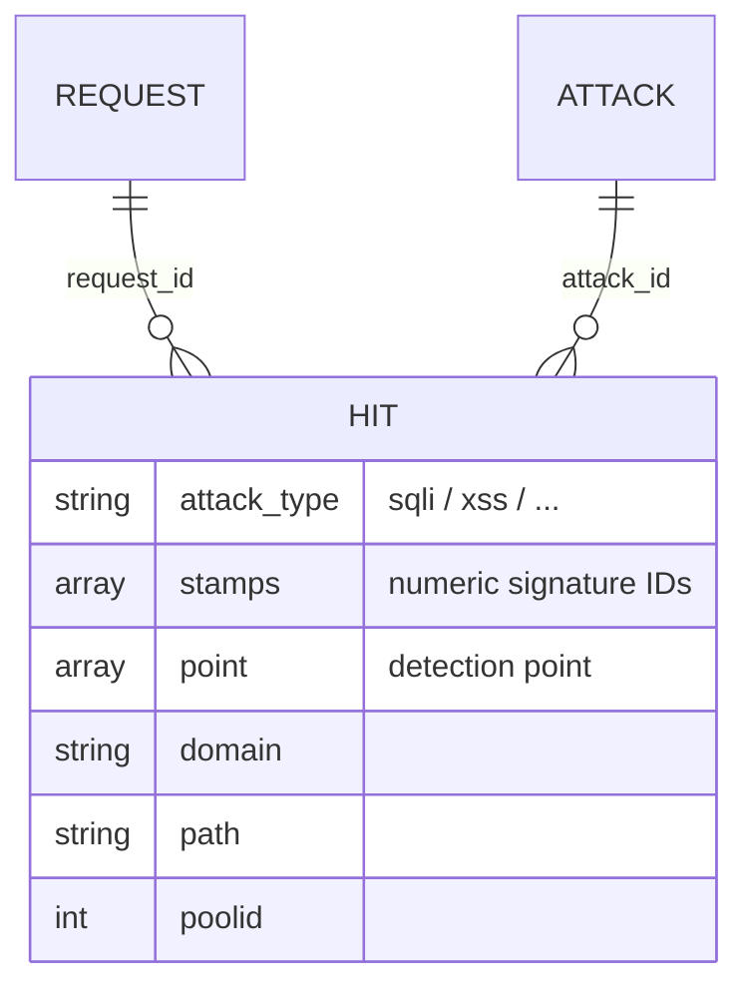

# Hits and attacks

Reference for the Wallarm hits/attacks domain model and the false-positive
suppression concept. The provider flow that turns hits into rules is
`hits-to-rules.md`; this doc is the domain model those pieces operate on.

## 1. Overview

A **hit** is a single detected threat within an HTTP request. Hits are
**ephemeral** - they have a retention period and can be dropped from the API at
any time. Some hits are false positives (legitimate traffic flagged as an
attack); the fix is a suppression rule scoped to a request point. This doc
defines the entities; `hits-to-rules.md` is the implementation that captures
them into Terraform state.

## 2. Model

A hit carries a detection **point** (where in the request the signature
matched), one or more **stamps** (numeric signature IDs), an **attack type**,
and request metadata (`domain`, `path`, `poolid`, `request_id`, `attack_id`).
Hits of the same HTTP request share `request_id`; hits of the same campaign
share `attack_id`. Suppression is expressed against an **action** (the match
scope: host + URL path + optionally the application instance) and a **point**.

## 3. Elements

| Entity | Meaning |
|---|---|
| hit | one detected threat in a request |
| stamp | a numeric signature ID (a specific attack fingerprint) |
| attack type | the attack category (`sqli`, `xss`, ...) |
| action | the match scope (host + path + optional instance) a rule targets |
| point | the detection point within the request |
| `data.wallarm_hits` | the data source that fetches and transforms hits (see `hits-to-rules.md`) |

## 4. Behavior

The false-positive suppression workflow:

1. **Fetch** - `data.wallarm_hits` retrieves hits for the given `request_id`(s).
2. **Group by action** - hits are grouped by their Host + URL-path scope.
3. **Group by point** - within each action, by detection point.
4. **Generate rules** - two suppression shapes:
   - `disable_stamp` - allow one specific signature (stamp) at a point;
   - `disable_attack_type` - allow a whole attack type at a point.
5. **One resource per rule** - each stamp and each attack type is a separate
   Terraform resource, matching the API 1:1.

Because hits age out of the API, the suppression config is captured into state
once and then persists independently of live hits (`hits-to-rules.md §4.2`).
**Stampless attack types** (`xxe`, `invalid_xml`) produce no stamps, so they can
be suppressed only via `disable_attack_type`.

## 5. Parameters

The `data.wallarm_hits` inputs/outputs and the `disable_stamp` /
`disable_attack_type` resource fields are in `hits-to-rules.md §5`; this doc adds
no parameters of its own.

## 6. Reference data

- **Default attack-type filter (16)** (`data.wallarm_hits`): `xss`, `sqli`,
  `rce`, `ptrav`, `crlf`, `redir`, `nosqli`, `ldapi`, `scanner`,
  `mass_assignment`, `ssrf`, `ssi`, `mail_injection`, `ssti`, `xxe`,
  `invalid_xml`.
- **Stampless types**: `xxe`, `invalid_xml` (no stamps; `disable_attack_type`
  only).
- **`for_each` key formats**: `{action_hash}_{point_hash}_{attack_type}_{stamp}`
  (stamp rules) or `{action_hash}_{point_hash}_{attack_type}` (attack-type
  rules); hash prefixes are 16 hex chars (`ConditionsHash` / `PointHash`
  truncated, `hits-to-rules.md §6.5`).

## 7. References

- `hits-to-rules.md` - the provider flow, data source, and rule behavior.
- `rules-core.md` - Action/Condition/Hint model; the `disable_stamp` /
  `disable_attack_type` rules.
- `action.md` - action-scope construction from a hit.
- `docs/guides/hits_to_rules.md` - operator how-to.
