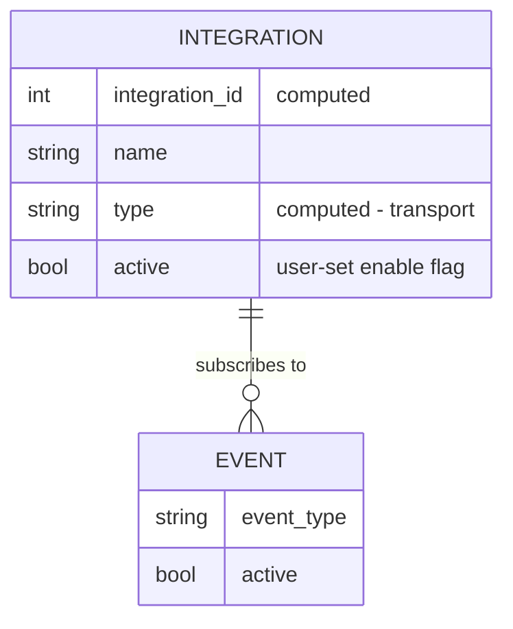

# Integrations

Reference for the 11 `wallarm_integration_*` resources: what they share, the
event-subscription model, and the current Read-completeness limitation. Full
per-integration field lists are the registry docs
(`docs/resources/integration_*.md`); this doc is the shared model and machinery.

## 1. Overview

Each integration resource connects Wallarm to an external system (chat, SIEM,
incident, webhook) and subscribes it to a set of Wallarm events. All 11 share
one CRUD shape: generic metadata + a transport-specific connection config + an
`event` subscription set.

## 2. Model

An integration is generic metadata (`integration_id`, `name`, `type`, `active`,
`created_by`, `client_id`) plus transport-specific connection fields plus an
`event` TypeSet, expanded to the API by `expandWallarmEventToIntEvents`.

## 3. Elements

| Resource | Transport |
|---|---|
| `wallarm_integration_data_dog` | Datadog |
| `wallarm_integration_email` | email recipients |
| `wallarm_integration_insightconnect` | Rapid7 InsightConnect |
| `wallarm_integration_opsgenie` | Opsgenie |
| `wallarm_integration_pagerduty` | PagerDuty |
| `wallarm_integration_slack` | Slack webhook |
| `wallarm_integration_splunk` | Splunk HEC |
| `wallarm_integration_sumologic` | Sumo Logic |
| `wallarm_integration_teams` | Microsoft Teams |
| `wallarm_integration_telegram` | Telegram |
| `wallarm_integration_webhook` | generic webhook |

`expandWallarmEventToIntEvents` converts the `event` set to the API payload.
It has no flatten counterpart - the reason Read is incomplete (§4).

## 4. Behavior

- **Create / Update** send the full config (transport fields + `event` set).
- **Read populates only generic metadata** (`integration_id`, `is_active`,
  `name`, `created_by`, `type`, `client_id`; e.g.
  `resource_integration_email.go:139-144`). It does **not** set the user-facing
  `active` flag, the `event` subscriptions, or any transport-specific config the
  API returned. Consequences:
  - `terraform import` + `-generate-config-out` yields incomplete HCL (`active`
    and transport config `null`, all `event {}` blocks missing).
  - Drift from console edits to events / config is invisible to plan.

  Known limitation tracked as roadmap **I1**. Import sections were removed from
  the 11 registry docs to avoid misleading users; they return when I1 lands.
- **No provider-level cache** backs integration Read yet (roadmap **I2**).
- The 11 resources duplicate CRUD structure; a shared factory is roadmap **I3**.

## 5. Parameters

Common fields (all integrations):

| Field | Notes |
|---|---|
| `integration_id` | computed |
| `type` | computed - transport identifier |
| `is_active` | computed - server state |
| `active` | user-set enable flag |
| `name` | integration name |
| `created_by` | computed |
| `client_id` | optional+computed |
| `event` | TypeSet of `{event_type, active}` subscriptions |

Transport-specific connection fields (`emails`, `webhook_url`, `api_url`,
`api_token`, `headers`, `with_headers`, `chat_data`, `integration_key`,
`timeouts`, ...) vary per resource; see `docs/resources/integration_*.md`.

## 6. Reference data

The `event_type` values and each transport's required connection fields are
enumerated per resource in the registry docs. Read behavior is uniform across
all 11 (§4).

## 7. References

- Roadmap `I1` (Read completeness), `I2` (cache), `I3` (factory extraction).
- `docs/resources/integration_*.md` - full per-integration field lists.
- `rules-core.md §3.4` - the `ProviderMeta` cache pattern a future I2 would follow.
