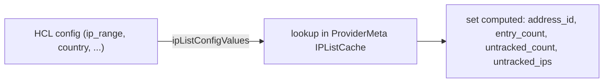

# IP lists

Reference for the `wallarm_allowlist` / `wallarm_denylist` / `wallarm_graylist`
resources: the config-driven Read, the incremental Update, the provider-level
cache, and the limits. Full field lists are the registry docs
(`docs/resources/{allowlist,denylist,graylist}.md`); the cache strategy is the
`terraform-provider-caching` skill.

## 1. Overview

The three IP list resources add IP/subnet entries to Wallarm's allow, deny, and
gray lists. Entries carry per-value IDs; Read records the derived IDs and counts
from a provider-level cache rather than reconciling every descriptive field from
the API, and Update applies changes in place.

## 2. Model

Each resource manages one list type. Descriptive fields are ordinary inputs
(not `ForceNew`); Read records the computed outputs, and Update reconciles
changes (§4).

## 3. Elements

| Element | Role |
|---|---|
| `resourceWallarmIPListRead` | shared Read for all three list types |
| `ipListConfigValues` | reads the user's HCL scope values for cache lookup |
| `resourceWallarmIPListUpdate` | Update handler (`resource_ip_list.go:273`) |
| `ipListSubnetDiffUpdate` | incremental add/remove of changed subnets (`:302`) |
| `IPListCache` (`ProviderMeta`, `config.go:19`) | per-list-type cache with Create serialization |

## 4. Behavior

- **Read is config-driven.** `resourceWallarmIPListRead` calls
  `ipListConfigValues(d)`, looks the values up in the cache, and sets the
  computed outputs `address_id`, `entry_count`, `untracked_count`,
  `untracked_ips` (plus `client_id`). It does not pull the descriptive fields
  (`ip_range`, `country`, `datacenter`, `application`, `proxy_type`, `reason`,
  `time`, `time_format`) back from the API - those stay as the user's config.
- **Update reconciles changes** (no field is `ForceNew`):
  - an `ip_range`-only change runs an incremental subnet diff
    (`ipListSubnetDiffUpdate`) that adds/removes only the changed IPs;
  - a change to metadata (`time_format` / `time` / `reason` / `application`)
    re-runs Create to rebuild the entry.
- **Cache** sits on `ProviderMeta`, fetches per list type, serializes Creates,
  and retries a refresh after Create (`IPListCacheMaxRetries` /
  `IPListCacheRetryDelay`). See the `terraform-provider-caching` skill.
- **Counts** validation via the `/access_rules/counts` endpoint is planned
  (roadmap **IPL1**).

## 5. Parameters

| Field | Kind | Notes |
|---|---|---|
| `ip_range` | input | the IP or CIDR; an isolated change diffs incrementally |
| `country` / `datacenter` / `proxy_type` | input | source classifiers |
| `application` | input | scope to an app/pool; a change re-creates the entry |
| `reason` | input | free-text label |
| `time` / `time_format` | input | expiry |
| `address_id` | computed | per-value ID from the cache |
| `entry_count` | computed | entries backing this resource |
| `untracked_count` / `untracked_ips` | computed | list entries the API returned that this config does not track |

Full shapes per list type are in the registry docs.

## 6. Reference data

`wallarm/provider/constants.go` (authoritative):

| Constant | Value | Purpose |
|---|---|---|
| `IPListPageSize` | 1000 | IP list groups per API call |
| `IPListMaxSubnets` | 1000 | max subnet values per IP list resource |
| `IPListCacheMaxRetries` | 3 | cache refresh retries after Create |
| `IPListCacheRetryDelay` | 3s | wait between retries |

## 7. References

- `terraform-provider-caching` skill - the `IPListCache` strategy.
- Roadmap `IPL1` - counts API validation.
- `docs/resources/{allowlist,denylist,graylist}.md` - full field lists.
