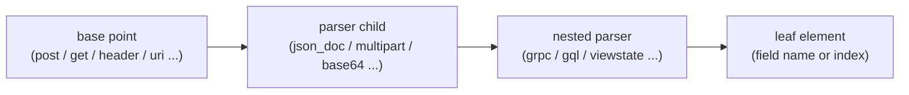

# Detection point chaining

Reference for the `point` field in Wallarm rules: how a point is a path through
the request parser tree, which elements are paired vs simple, and which children
a given parser context allows. The Action/Condition/Hint model that consumes
points is in `rules-core.md`; this doc is the point-chaining detail.

## 1. Overview

A `point` locates the exact place in a request a rule inspects - a header value,
a JSON field, a path segment, a decoded blob. In HCL it is a **list of lists of
strings** (2D): each inner list is one step, and the steps chain from a base
parser down through nested parsers to the leaf. The Go authority is
`WrapPointElements` (`wallarm/common/resourcerule/action_expand.go`), which pairs
and wraps the elements; the full chaining data is `spec/point_map.json` (fetched
by `scripts/fetch_point_refs.py`, refresh every 30 days).

## 2. Model

Each step is one of two shapes:

- **Paired** (2-part, `["element", "value"]`): the element addresses a named or
  indexed child, so it carries a value - a key name (`["header","HOST"]`) or an
  index (`["path",0]`).
- **Simple** (1-part, `["element"]`): a parser or whole-part element with no
  addressing value (`["post"]`, `["json_doc"]`, `["uri"]`).

A chain is valid only when each child is reachable from its parent context
(§4). `WrapPointElements` turns the flat element list into the wrapped 2D form
the API expects.

## 3. Elements

| Element | Role |
|---|---|
| `WrapPointElements` (`action_expand.go`) | Go authority: pairs/wraps a flat element list into the 2D `point` |
| `spec/point_map.json` | full chaining data (base points, children, paired/simple/array/parser flags) |
| `proton-types.md` | Proton type IDs + simple/keys/array/parser flags + attack-type IDs |

## 4. Behavior

- A chain starts at a **base point** (level 1) and descends only into that
  base's allowed children (§6.1).
- **Context-specific children** are legal only under a specific parent (§6.4):
  e.g. `cookie` only under `header`/`header_all`; `form_urlencoded` / `multipart`
  / `grpc` only under `post` (`gql` under `post` or `get`); `protobuf` only under
  `grpc` (itself under `post`); `content_disp` only under `multipart > header`.
- A parser reached through `gzip` (e.g. `post > gzip > json_doc`) exposes the
  same post-context children as the uncompressed path.
- Paired elements take a value of the type in §6.2 (string key or integer index);
  simple elements take none.

## 5. Parameters

The `point` field itself is the only parameter; its element vocabulary and
value types are the reference data in §6. See `rules-core.md §5.2` for the
`point` schema (Required, ForceNew, `TypeList` of list-of-strings).

## 6. Reference data

### 6.1 Base points (level 1) and allowed children

| Base point(s) | Allowed children |
|---|---|
| `action_ext`, `action_name`, `get_name`, `header_name`, `path`, `path_all`, `uri` | `base64`, `gzip`, `htmljs`, `json_doc`, `jwt`, `jwt_all`, `percent`, `xml` |
| `get`, `get_all` | `array`, `array_all`, `base64`, `gql`, `gzip`, `hash`, `hash_all`, `hash_name`, `htmljs`, `json_doc`, `jwt`, `jwt_all`, `percent`, `xml` |
| `header`, `header_all` | `array`, `array_all`, `base64`, `cookie`, `cookie_all`, `cookie_name`, `gzip`, `htmljs`, `json_doc`, `jwt`, `jwt_all`, `percent`, `xml` |
| `post` | `base64`, `form_urlencoded`, `form_urlencoded_all`, `form_urlencoded_name`, `gql`, `grpc`, `grpc_all`, `gzip`, `htmljs`, `json_doc`, `jwt`, `jwt_all`, `multipart`, `multipart_all`, `multipart_name`, `percent`, `xml` |

### 6.2 Paired elements (`["element", "value"]`)

| Element | Value type | Example |
|---|---|---|
| `header`, `cookie`, `get`, `hash`, `form_urlencoded`, `multipart`, `content_disp`, `response_header` | string (key/field name) | `["header", "HOST"]` |
| `jwt`, `json`, `json_obj`, `xml_tag`, `xml_attr`, `protobuf` | string (key/field name) | `["jwt", "payload"]` |
| `gql_query`, `gql_mutation`, `gql_subscription`, `gql_fragment`, `gql_dir`, `gql_spread`, `gql_type`, `gql_var` | string (operation/field name) | `["gql_query", "getUser"]` |
| `viewstate_dict`, `viewstate_sparse_array` | string (key name) | `["viewstate_dict", "key"]` |
| `path`, `array`, `json_array`, `grpc` | integer (index) | `["path", 0]`, `["grpc", 1]` |
| `xml_pi`, `xml_dtd_entity`, `xml_tag_array`, `xml_comment` | integer (index) | `["xml_pi", 0]` |
| `viewstate_array`, `viewstate_pair`, `viewstate_triplet` | integer (index) | `["viewstate_array", 0]` |

### 6.3 Simple elements (`["element"]`)

`post`, `json_doc`, `xml`, `uri`, `action_name`, `action_ext`, `route`,
`remote_addr`, `response_body`, `file`, `base64`, `gzip`, `htmljs`, `percent`,
`pollution`, `gql`, `gql_alias`, `gql_arg`, `gql_inline`, `viewstate`,
`viewstate_dict_key`, `viewstate_dict_value`, `protobuf_int32`,
`protobuf_int64`, `protobuf_varint`, `xml_dtd`.

### 6.4 Context-specific children

| Element | Context required | Example chain |
|---|---|---|
| `cookie`, `cookie_all`, `cookie_name` | under `header` / `header_all` | `[["header","COOKIE"],["cookie","session"]]` |
| `form_urlencoded`, `multipart`, `grpc`, `gql` | under `post` | `[["post"],["form_urlencoded","field"]]` |
| `gql` in `json_doc` | under `post > json_doc` | `[["post"],["json_doc"],["gql"]]` |
| `gql` in `percent` | under `post > form_urlencoded > percent` or `get > percent` | `[["get","q"],["percent"],["gql"]]` |
| `protobuf`, `protobuf_all`, `protobuf_name` | under `grpc` (under `post`) | `[["post"],["grpc",1],["protobuf","field"]]` |
| `viewstate` + sub-elements | under `base64` after a parser context | `[["post"],["form_urlencoded","f"],["base64"],["viewstate"]]` |
| `file`, nested `header` | under `multipart` | `[["post"],["multipart","upload"],["file"]]` |
| `content_disp` | under `multipart > header` | `[["post"],["multipart","f"],["header","Content-Disposition"],["content_disp","filename"]]` |

## 7. References

- `rules-core.md` - Action/Condition/Hint model and the `point` schema.
- `proton-types.md` - Proton type/attack-type IDs and element flags.
- `regex.md` - Pire syntax for `regex`-typed conditions at a point.
- `spec/point_map.json` - raw chaining data.
