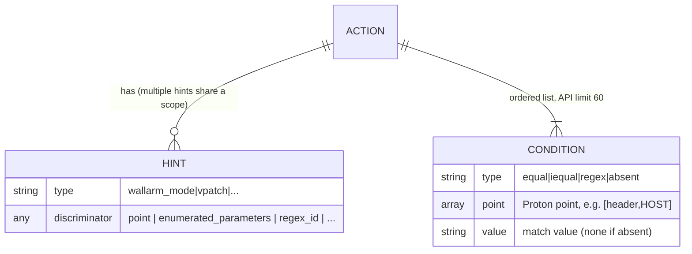

# Rules core (Action / Condition / Hint model + shared machinery)

Reference for the shared model and code behind every `wallarm_rule_*`
resource: the Action/Condition/Hint domain model, the `resourcerule` CRUD
machinery, registration seams, common schema, and the resource catalog. Rules
with materially different structure (rate_limit, graphql_detection,
api_abuse_mode, credential_stuffing) and the counter/trigger coupling get their
own docs; this one is the shared foundation they build on.

## 1. Overview

A Wallarm rule is stored server-side as an **Action + Hint** pair. The Action
is a match scope (an ordered list of Conditions); the Hint is the behavior
applied when the scope matches. The provider exposes ~26 `rule_*` resources
that all share this model, the same CRUD helpers in
`wallarm/common/resourcerule/`, and the common schema fields in
`wallarm/provider/schema_common.go`. Each resource file is
`wallarm/provider/resource_rule_<name>.go`.

Two product categories sit on the same API model:

- **Mitigation controls** - session-based, real-time mitigation (mode,
  graphql_detection, enum, bola, brute, forced_browsing, rate_limit_enum,
  file_upload_size_limit).
- **Rules** - request-level, applied per request during traffic analysis
  (everything else).

The distinction is product-facing, not structural: both are Action + Hint.

## 2. Model

An **Action** is a scope: an ordered list of Conditions (max 60). Multiple Hints
can share one Action (API limit: 60 conditions per action, server-enforced -
`action.md`). An **Endpoint** is just an Action with `endpoint: true`.
Identical conditions reuse an existing Action via `find_or_create` keyed on a
deterministic SHA256 `conditions_hash`; the server auto-removes an Action when
its last Hint is deleted. The provider never calls `ActionDelete` - only
`HintCreate` / `HintDelete`, both of which trigger server-side LOM
recompilation.

A **Condition** maps to one `action {}` block in HCL:

| Field | Values |
|---|---|
| `type` | `equal` / `iequal` / `regex` / `absent` (default `equal`) |
| `point` | Proton point array - `["header","HOST"]`, `["path",0]`, `["method"]`, `["instance"]`, `["action_name"]`, `["action_ext"]`, `["uri"]`, `["query","NAME"]` |
| `value` | Match value (absent for `type=absent`) |

## 3. Elements

### 3.1 `resourcerule` package (`wallarm/common/resourcerule/`)

| File | Responsibility |
|---|---|
| `rule_crud.go` | Shared `Read` / `Create` / `Update` |
| `rule_import.go` | Shared 3-part import (`Import`) |
| `rule_delete.go` | Shared `Delete` |
| `counter_delete.go` | Counter-specific delete handling |
| `action_expand.go` | `ExpandSetToActionDetailsList`, `WrapPointElements`, `ExpandPointsToTwoDimensionalArray` |
| `action_hash.go` | `HashActionDetails`, `TransformAPIActionToSchema`, `ActionDetailsToMap` |
| `hash.go` | `ConditionsHash`, `PointHash` - Ruby-compatible SHA256 via `rawPack` (DB-verified against 4 real examples) |
| `action_dir.go` | `ActionDirName` - filesystem-safe scope name, `{instance}_{domain}_{path}_{hash8}`, max 64 chars (prefix truncated at the last `_`) |
| `action_scope.go` | `ScopeActionSchema`, `ActionScopeCustomizeDiff`, `validateActionBlocks`, `PointValuePoints` (map of points whose value lives in the point map: `action_name`, `action_ext`, `method`, `instance`, ...) |
| `action_reverse_map.go` | `APITypeToTerraformResource`, `FourPartIDTypes`, reverse mapping |
| `mapper_tftoapi.go` / `mapper_apitotf.go` | schema <-> API conversion |
| `enumerated_params_diff.go` | `EnumeratedParamsCustomizeDiff` |
| `update_customizers.go` | Update customizer options |
| `const.go` | point-key / match-type constants, `ReadOption`/`CreateOption` |

### 3.2 Duplicate-rule guard

`existingHintForAction` (`wallarm/provider/action_helpers.go:25`) is a
client-side UX guard, not an API constraint - the API accepts duplicates and
resolves them async (last-write-wins or silent removal), which diverges state.
Before `HintCreate` it does `ActionList` + `HintRead` and, on a same-scope
same-type hit, aborts with `ImportAsExistsError` (`action_helpers.go:129`). It
is intentionally mode-agnostic (keys on `client_id` + hint type +
`conditions_hash`), so it also catches the contradiction case (same scope,
different mode). Wired only for the single-hint-per-`(scope,type)` shape (§3.5);
other shapes carry a real discriminator.

### 3.3 Registration seams (both required)

1. `provider.go` `ResourcesMap` - makes the resource callable in HCL.
2. `action_reverse_map.go` `APITypeToTerraformResource` (`:510`) - maps the API
   rule-type string to the TF resource name; consumed by `data.wallarm_rules`
   for bulk import. **Unknown types are silently skipped** - a missing entry
   means rules of that type can't be discovered/imported.

`FourPartIDTypes` (`:541`) lists rule types whose import ID needs a 4th segment:
`regex`, `experimental_regex` (suffix = rule type), `wallarm_mode` (suffix =
mode). All others use the 3-part default.

### 3.4 Caches

- Hint cache (`wallarm/provider/hint_cache.go`) - `CachedClient` wraps
  `wallarm.API`, intercepts `HintRead`, lazy-paginates (one page at a time,
  stops when the ID is found), mutex-guarded.
- Credential-stuffing cache (`credential_stuffing_cache.go`) - one call returns
  all configs, stored on `ProviderMeta`.

### 3.5 Resource catalog and shape mapping

26 `rule_*` resources (`wallarm_rule_generator` is an HCL emitter, not an API
rule - see the hcl-generator doc). The **shape** is what discriminates two
hints on the same scope; it decides whether `existingHintForAction` applies.

| Shape | Discriminator | Resources | guard? |
|---|---|---|---|
| single hint per `(scope,type)` | none | `mode`, `api_abuse_mode`, `overlimit_res_settings` | yes |
| point-discriminated | `point` | `vpatch`, `disable_stamp`, `disable_attack_type`, `rate_limit`, `file_upload_size_limit`, `set_response_header`, `masking`, `binary_data`, `uploads`, `parser_state`, `ignore_regex` | no |
| conditions-discriminated | `enumerated_parameters` / `arbitrary_conditions` | `brute`, `bola`, `enum`, `forced_browsing`, `rate_limit_enum`, `graphql_detection` | no |
| distinct rule identity | `regex_id` / login+regex | `regex` (incl. experimental), `credential_stuffing_regex`, `credential_stuffing_point` | no |
| counter | bound to `wallarm_trigger` | `bruteforce_counter`, `dirbust_counter`, `bola_counter` | no |

Per-resource prose descriptions live in the registry user docs
(`docs/resources/rule_*.md`); per-hint field ground truth is
`rules_api_fields.md`.

### 3.6 wallarm-go Action API surface

| Method (`wallarm-go/action.go`) | Endpoint | Use |
|---|---|---|
| `ActionList(params)` | `POST /v1/objects/action` | list actions by filter |
| `ActionReadByID(id)` | `GET /v3/action/{id}` | read one action |
| `ActionReadByHitID(ids)` | `POST /v1/objects/action/by_hit` | derive an action scope from hits (`hits-to-rules.md`) |

Two provider resources sit directly on this surface: `wallarm_action`
(read-only manual action tracking) and `data.wallarm_actions` (paginated
discovery of all non-empty actions).

## 4. Behavior

### 4.1 Condition normalization (mirrored client-side for stable state)

- `iequal` values are lowercased server-side; the provider lowercases them (e.g.
  HOST domains).
- Header **names** are uppercased; `ExpandSetToActionDetailsList` and
  `TransformAPIActionToSchema` uppercase on both directions.
- Instance conditions keep `type="equal"` in state (not `""`), but
  `HashActionDetails` normalizes instance type to `""` for hashing so config and
  state hash identically. Preservation spans several seams:
  `TransformAPIActionToSchema` carries the type back from the API;
  `ScopeActionSchema` sets `Set: HashActionDetails`; `type` is `Computed`, so an
  omitted type inherits from state; `ExpandSetToActionDetailsList` defaults
  `Type="equal"`. `HashResponseActionDetails` is retained for back-compat but
  unused. Keeping the real type leaves room for future `type="regex"` instance
  matching.
- Condition `value` is nil-normalized before hashing so a TypeSet hash stays
  stable: `ConditionsHash` maps a nil value to `null` (`hash.go:71-97`) and
  `ActionDetailsToMap` normalizes an absent/nil `value` to `""` so the key is
  always present (`action_hash.go:276`). Code producing action conditions must
  keep string values non-nil.

### 4.2 Path expansion and points

A URL path decomposes into `path[N]` / `action_name` / `action_ext` conditions;
the full algorithm (wildcards, headers, query, root path, `uri` exclusivity) is
in `action.md`. Point values chain through the parser tree as 2D
paired/simple lists (`point.md`, authority `WrapPointElements`).

> **Known bug (R-002):** the path decomposition currently splits the final
> segment on the *last* dot at both sites (`actionNameExtConditions`,
> `parseLastSegment`); the correct/API split is the *first* dot. See
> `action.md §4.3` and `hits-to-rules.md §4.4`.

### 4.3 Variativity (load-bearing)

`variativity_disabled` schema field is `Optional, Default: true`, and
`resourcerule.Create` hardcodes `VariativityDisabled: true`
(`rule_crud.go:206`) regardless of the user's value. Denying server-side rule
mutation keeps TF state synchronized (the API can otherwise mutate variative
rules out-of-band as signatures evolve). Do not "fix" this without a design
discussion.

### 4.4 Create / delete semantics

- `HintDelete` (wallarm-go client, `POST /v1/objects/hint/delete`) returns
  **HTTP 200 always**; only the body distinguishes success (`body:[<hint>]`)
  from no-op (`body:[]`) (`rule_delete.go:14`, `counter_delete.go:14`). Code
  that must confirm a delete happened checks `len(body) > 0`.
- Counters (`brute_counter`, `dirbust_counter`, `bola_counter`) cannot be
  deleted on demand - the server returns `body:[]` and auto-cleans ~30s after
  the last `wallarm_trigger` reference is removed. Drift tests simulating
  console deletion must use a non-counter type.

### 4.5 Plan-time validation and diff gotchas

- **Mode <-> reaction** (`brute`, `bola`, `forced_browsing`, `rate_limit_enum`,
  ...): API enforces `block` -> `block_by_session`/`block_by_ip` only;
  `monitoring` -> `graylist_by_ip` only. Schema does not enforce it (runtime 400,
  body `{"reaction":{"error":"keys should contain only [:graylist_by_ip] keys for the mode monitoring"}}`).
  `brute.mode` is `ForceNew`, so a mutation test must pin a single mode and flip a
  different mutable field (e.g. `threshold.count`).
- **`enumerated_parameters` mode<->fields** (`EnumeratedParamsCustomizeDiff`):
  `exact` -> only `points`; `regexp` -> `name_regexps`+`value_regexps`
  (both required) + `additional_parameters`/`plain_parameters`. Use `[""]` to
  opt out of one filter.
- **`arbitrary_conditions.point`** round-trips flat (API) <-> 2D (HCL) via
  `WrapPointElements` (`ArbitraryConditionsToTF`); a new nested-`point` rule that
  skips this force-replaces every plan.
- **`GetPointerIfConfigured[T]`** (`rule_crud.go`): Optional+Computed primitives
  with non-zero API defaults must not send a literal zero when unset; reads
  `d.GetRawConfig()` and returns `nil` so `omitempty` drops the field.

### 4.6 Read path (audit trap)

`resourcerule.Read` uses `setIfExists(d, key, val)` (schema-aware, skips fields
absent from the resource) for ~34 rule-specific fields - a grep for literal
`d.Set("...")` misses them. Genuinely-unread config-only fields (intentional):
`wallarm_tenant.prevent_destroy`, `wallarm_user.password`.

## 5. Parameters

### 5.1 `commonResourceRuleFields` (`schema_common.go`)

| field | type | notes |
|---|---|---|
| `rule_id` | int | computed - hint ID in Wallarm |
| `action_id` | int | computed - action (rule branch) ID |
| `rule_type` | string | computed - API type identifier |
| `client_id` | int | optional+computed, `IntAtLeast(1)` |
| `comment` | string | optional, default `"Managed by Terraform"`; API rejects `""` |
| `set` | string | optional (not computed - avoids empty-string masking) |
| `active` | bool | optional |
| `title` | string | optional; independent of `comment` |
| `variativity_disabled` | bool | optional, default `true` (also hardcoded, §4.3) |
| `mitigation` | - | optional+computed, never sent to API |

### 5.2 Action and point schema

- `action` = `ScopeActionSchema()` - TypeSet, **Optional+Computed**, `ForceNew`
  (a scope change is a different hint), element hashed by `HashActionDetails`.
- `point` = `defaultPointSchema` - `TypeList` of list-of-strings (2D),
  **Required, ForceNew**.

### 5.3 Per-type distinguishing fields

Each resource adds its discriminator/config fields via `lo.Assign(fields,
commonResourceRuleFields, ...)`. The discriminator per shape is in §3.5; the
probe-derived per-hint field ground truth is `rules_api_fields.md`.
Structurally-distinct rules are documented separately.

## 6. Reference data

### 6.1 Condition point -> Terraform scope field

| Proton point | TF field (`action.point.*` / `action_*`) |
|---|---|
| `[header,'HOST']` | `domain` |
| `[path,N]` | `path` (segment N) |
| `[action_name]` | `action_name` |
| `[action_ext]` | `action_ext` |
| `[method]` | `method` |
| `[instance]` | `instance` (pool ID) |
| `[uri]` | `uri` (conflicts with path/action_name/action_ext/query) |
| `[query,KEY]` | `query` |

### 6.2 Import ID formats

- 3-part default: `{client_id}/{action_id}/{rule_id}`.
- 4-part (`FourPartIDTypes`): `regex`, `experimental_regex`, `wallarm_mode`.

### 6.3 Limits and API validation

| Constraint | Value |
|---|---|
| Conditions per action | max 60 |
| Reaction range | 600..315569520 |
| `graphql_detection.max_value_size_kb` | 1..100 |
| `comment` | non-empty (API rejects `""`) |

### 6.4 attack_type allowlists

Per-resource curated subsets of the Proton enum: `disable_attack_type` / `vpatch`
accept `any` and `invalid_xml`; `regex` accepts `vpatch` instead. Authoritative
live set: `GET /v2/attack_types`. Offline: `proton-types.md`.

## 7. References

- `action.md` - path-expansion algorithm + server Action/Condition/Hint table model.
- `point.md` - point chaining tables; `spec/point_map.json` (raw data).
- `regex.md` - Pire engine syntax + HCL escaping.
- `proton-types.md` - Proton type/attack-type IDs.
- `rules_api_fields.md` - probe-derived per-hint field ground truth.
- `schema-decisions.md` - schema attribute decision tree.
- `spec/actions_examples.json` - 82 representative action condition examples
  (one per distinct shape; deduped from a 343-sample probe).
- `create-rule-resource` skill - canonical build flow for a new `rule_*` resource.
- `hits-to-rules.md` - FP-suppression rules from hits. Counters/triggers: T-004.
