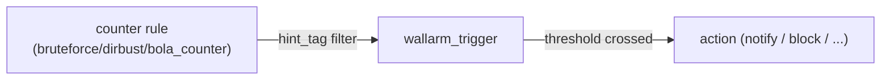

# Triggers

Reference for the `wallarm_trigger` resource: what it is, how it couples to
counter rules, and the current Read-completeness limitation. Full field lists
are the registry doc (`docs/resources/trigger.md`); counter rules are in
`rules-core.md`.

## 1. Overview

A `wallarm_trigger` fires an action (notification, block, etc.) when a counter
rule's threshold is crossed within a window. It is the active half of the
counter/trigger pair: a counter rule accumulates hits, and the trigger reacts.

## 2. Model

A trigger binds to one or more counter rules through `hint_tag` filters; when
its `threshold` is met it runs its `actions`. Removing the last trigger that
references a counter lets the server auto-clean that counter (~30s later, see
`rules-core.md §4.4`).

## 3. Elements

| Element | Role |
|---|---|
| `wallarm_trigger` | the trigger resource (`resource_trigger.go`) |
| `expandWallarmTriggerFilter` | HCL `filters` -> API |
| `expandWallarmTriggerThreshold` | HCL `threshold` -> API |
| `expandWallarmTriggerAction` | HCL `actions` -> API |

There are no `flatten*` counterparts - the reason Read is incomplete (§4).

## 4. Behavior

- **Create / Update** send the full trigger (`filters`, `actions`, `threshold`,
  `template_id`, `enabled`, `name`, `comment`).
- **Read populates only `trigger_id` and `client_id`** (`resourceWallarmTriggerRead`,
  `resource_trigger.go`): it finds the matching trigger in the API response but
  never sets `template_id`, `enabled`, `name`, `comment`, `filters`, `actions`,
  or `threshold`. Consequences:
  - `terraform import` leaves state with two fields; the user must hand-write the
    full config, and the next `apply` risks overwriting live state.
  - Drift from console edits is invisible (Read never inspects those fields).
  - Acceptance tests cannot use `ImportStateVerify: true`.

  Known limitation tracked as roadmap **T1** (needs `flattenTriggerFilters` /
  `flattenTriggerActions` / `flattenTriggerThreshold` + `d.Set` for every field).
- `comment` and `lock_time` carry the same SDKv2 zero-value masking risk as the
  rule-side fields; addressed alongside T1 as roadmap **T2**.
- The registry doc's `## Import` section is deferred until T1 lands (**T3**);
  trigger-complexity reduction is **T4**.

## 5. Parameters

| Field | Notes |
|---|---|
| `trigger_id` | computed |
| `client_id` | optional+computed |
| `template_id` | trigger template |
| `name` / `comment` | labels |
| `enabled` | active flag |
| `filters` | `hint_tag` (and other) filters binding counters |
| `threshold` | count + window |
| `actions` | reaction(s) when the threshold is crossed; each carries a nested `lock_time` (reaction lock duration) |

Full field shapes are in `docs/resources/trigger.md`.

## 6. Reference data

Counters that pair with triggers: `wallarm_rule_bruteforce_counter`,
`wallarm_rule_dirbust_counter`, `wallarm_rule_bola_counter` (catalog in
`rules-core.md §3.5`). Counter auto-clean delay: ~30s after the last trigger
reference is removed.

## 7. References

- Roadmap `T1` (Read completeness), `T2` (`comment`/`lock_time` zero-value),
  `T3` (import docs), `T4` (complexity).
- `rules-core.md` - counter rules and the counter/trigger coupling.
- `docs/resources/trigger.md` - full field lists.
